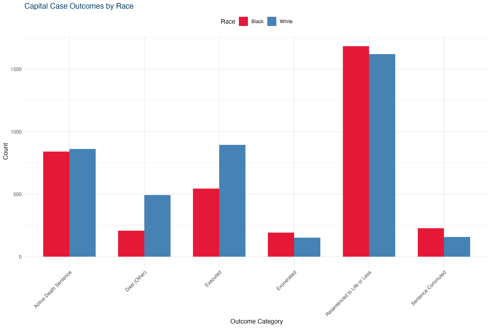
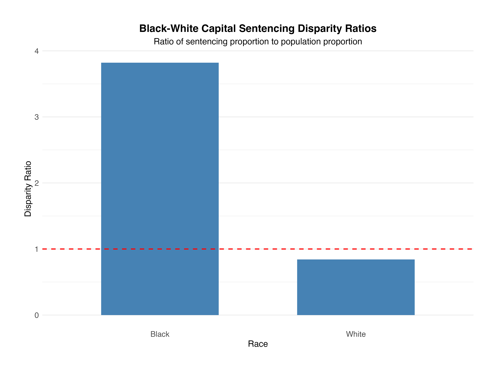

```{r setup, include=FALSE}
knitr::opts_chunk$set(echo = TRUE)
#install.packages("pak")
#install.packages("posterdown")
pak::pak('rstudio/pagedown')
library(readr)
library(dplyr)
library(tidyverse)
library(ggplot2)
library(here)
library(kableExtra)
here::i_am("poster-template.Rmd")
```

```{r, eval=F, include=FALSE}
# do not remove; this line is to create the PDF version of your poster
# update.packages(c("pagedown", "servr"))

pagedown::chrome_print("poster-template.Rmd")
```

# Abstract

We explore disparities in U.S. capital punishment. Our hypotheses align with studies indicating that Black Americans are incarcerated at higher rates than other groups. We examine measures of difference in administrative data on life in prison and the death penalty.

# Overview

@bohm2016deathquest, in Deathquest, presents a foundational analysis of capital punishment theories and practices in the United States, while scholars like @alexander2021new extensively examined mass incarceration's historical roots and racialized impacts (e.g., The New Jim Crow). However, systematic research on contemporary capital punishment remains comparatively limited. This gap underscores the need for more empirical studies to establish baseline data on sentencing disparities, and prosecutorial decision-making.
 
# Research Questions

1.  What are the sentencing outcome distributions: Executed, Exonerated, Resentenced, Sentence Commuted, and Died?

2.  Are defendants proportionally represented across sentencing outcomes, or do disparities exist indicating that one racial group (Black or White) is overrepresented or underrepresented?

# Method

We conduct an exploratory analysis on capital punishment. 

We use computational methods in R and Python to gather and clean data sets. We integrate data from the Death Penalty Information Center (DPIC) and the U.S. Census Bureau to analyze disparity ratios between Black and White individuals. The DPIC provides comprehensive data, reports, and analyses on capital punishment trends and issues. Census data provides population estimates.

## Analytic Model

We use a disparity ratio to compare difference in outcomes between Black and White sentences, which is defined as follows:

$$
\frac{\text{Capital Sentencing Proportion}}{\text{Population Proportion}} = \frac{\dfrac{n}{\sum n}}{\dfrac{\text{estimate}}{\sum \text{estimate}}}
$$

The capital sentencing proportion is divided by the population proportion for each group. The capital sentencing proportion is the ratio of sentences for a group ($n$) over the total ($\sum{n}$); a similar ratio is computed for the population proportion estimates, which is a population estimate of a group over the total population estimate.

## Data

**Death Penalty Information Center**: Death Penalty Census Database

**U.S. Census Data**: 2023 ACS 5-year Estimates

Collapsed categories in capital punishment data guided the analysis:

- **Executed**: The legal process by which a person sentenced to death is put to death as a form of punishment.

- **Exonerated**: A legal declaration that a person previously convicted of a crime is officially cleared of all charges.

- **Resentenced to Life or Less**: A judicial action where a defendant's original sentence—often a death sentence or a lengthy prison term—is reduced to a lesser sentence, such as life imprisonment without the possibility of parole or life with the possibility of parole.

- **Sentence Commuted**: The reduction or alteration of a defendant's original sentence by a executive authority (such as a governor or president), which shortens the length of imprisonment or changes the nature of the punishment. 

- **Died (Other)**: Death by means other than execution.

# Findings

```{r, include=F, warning=F, messages=F}
sentences <- read.csv("../data/sentences.csv")
str(sentences)
```

```{r, include=F, warning=F, messages=F}
sentences2 <- sentences %>%
  mutate(Outcome_Category = case_when(
      Outcome.of.Sentence %in% c("Executed",
                                 "Executed for a Different Crime", 
                                 "Executed by a Different State", 
                                 "Executed for a Different Crime Pending Retrial or Resentencing"
                                 ) ~ "Executed",
      
      Outcome.of.Sentence %in% c("Resentenced to Death", 
                                 "Resentenced to Life or Less", 
                                 "Resentenced to Time Served"
                                 ) ~ "Resentenced to Life or Less",
      
      Outcome.of.Sentence %in% c("Exonerated",
                                 "Grant of Relief (Retrial/Resentencing Pending)", 
                                 "Grant of Relief (Never Retried)", 
                                 "Grant of Relief (Subject to Appeal)",
                                 "Conviction Voided", 
                                 "Conviction Voided, Convicted and Sentenced to Life or Less in Another Jurisdiction",
                                 "Not Guilty by Reason of Insanity", 
                                 "Acquitted, Convicted and Sentenced to Death in Another Jurisdiction"
                                 ) ~ "Exonerated",
      
      Outcome.of.Sentence %in% c("Died on Death Row",
                                 "Died Pending Retrial or Resentencing") ~ "Died (Other)", 
      
      Outcome.of.Sentence %in% c("Active Death Sentence")  ~ "Active Death Sentence",
      
      Outcome.of.Sentence %in% c("Sentence Commuted (Administrative)", 
                                 "Sentence Commuted", 
                                 "Sentence was Commuted to life without parole", 
                                 "Sentence was Commuted to time served"
                                 ) ~ "Sentence Commuted",
      
      TRUE ~ NA_character_  # For outcomes that don't fit or need review
    )
  ) %>% 
  relocate(defendant, 
           sentence, 
           Year, 
           Gender, 
           Races, 
           Outcome.of.Sentence, 
           Outcome_Category, 
           Current.Case.Status, 
           Region,
           State.Abbreviation) %>% 
  mutate(Multi.sentence.identifier = as.numeric(Multi.sentence.identifier))

# drop all races except for white and black
sentences3 <- sentences2 %>%
  as.tibble() %>% 
  filter(Races %in% c("White", "Black")) %>% 
  rename(outcome_original = Outcome.of.Sentence) %>% 
  rename(outcome_category = Outcome_Category) %>% 
  rename(race = Races) %>% 
  rename(year = Year) %>% 
  rename(gender = Gender) %>% 
  rename(state = State.Abbreviation) %>% 
  rename(region = Region) %>% 
  rename(name = Name) %>% 
  mutate(multiple_sentences = !is.na(Multi.sentence.identifier))

# count rows per defendant
sentences3 %>%
  count(defendant) %>%
  filter(n > 1) %>%
  arrange(desc(n))

sentences3_clean <- sentences3 %>% 
  # Group by defendant
  group_by(defendant) %>%
  # Count original rows and keep most recent record
  mutate(count_of_records = n()) %>%
  arrange(desc(year)) %>%
  slice(1) %>%
  # Ungroup
  ungroup()

# count rows per defendant
sentences3_clean %>%
  count(defendant) %>%
  filter(n > 1) %>%
  arrange(desc(n))

# create two data sets by cases
df <- sentences3_clean %>% 
  relocate(defendant, year, gender, race, outcome_category, outcome_original, region, state, multiple_sentences, count_of_records, name)
single <- df %>% 
  filter(count_of_records == 1)
multiple <- df %>% 
  filter(count_of_records > 1)
df
single
multiple
```

```{r, include=F, warning=F, messages=F}
glimpse(df) %>% 
  select(Name = "name",
         Year = "year",
         multiple_sentences,
         count_of_records,
         Category = "outcome_category") %>% 
  as.tibble()
```

```{r, include=F, warning=F, messages=F}
library(tidycensus)
# gather population estimates from Census data
# Filter for Black/White defendants and calculate counts
sentencing_race <- df %>%
  filter(race %in% c("Black", "White")) %>%  # Keep only Black/White
  count(race) %>%
  mutate(race = tolower(race))  # Match ACS race labels ("black", "white")

# Get race_pop including ALL racial groups (for accurate denominator)
race_pop_all <- get_acs(
  geography = "us",
  variables = c(
    white = "B02001_002",
    black = "B02001_003",
    asian = "B02001_005",
    hispanic = "B03003_003"  # Add other groups as needed
  ),
  year = 2023,
  survey = "acs5"
) %>%
  select(race = variable, us_pop = estimate)

# Calculate disparity using total US population denominator
disparity_df <- sentencing_race %>%
  left_join(
    race_pop_all %>% filter(race %in% c("black", "white")),
    by = "race"
  ) %>%
  mutate(
    us_pct = us_pop / sum(race_pop_all$us_pop),  # Key change: total pop denominator
    sentenced_pct = n / sum(n),
    disparity_ratio = sentenced_pct / us_pct
  )

# Result includes only Black/White but uses full population denominator

# view the df
disparity_df
# columns: race | n | us_pop | moe | us_pct | sentenced_pct | disparity_ratio
```

## Sentencing Outcome Distribution

```{r, include=F, warning=F, messages=F}

# Remove NA outcomes
df_clean <- df %>% 
  filter(!is.na(outcome_category))

# Verify removal
# table(df_clean$outcome_category, useNA = "always")

# Define colors manually
race_colors <- c(
  "White" = "steelblue",
  "Black" = "#E51937",  # Red from your poster palette
  "Asian" = "#5F6062",  # Gray from your palette (optional)
  "Hispanic" = "#8C8C8C"  # Light gray (optional)
)

df_clean %>%
  count(race, outcome_category) %>%
  ggplot(aes(x = outcome_category, y = n, fill = race)) +
  geom_col(position = "dodge", width = 0.7) +
  scale_fill_manual(values = race_colors) +  # Apply custom colors
  labs(
    title = "Capital Case Outcomes by Race",
    x = "Outcome Category",
    y = "Count",
    fill = "Race"
  ) +
  theme_minimal() +
  theme(
    axis.text.x = element_text(angle = 45, hjust = 1),
    legend.position = "top",
    plot.title = element_text(color = "#003A63")  # Navy title
  )

ggsave("img/outcome_plot_branded.png",
       width = 12,
       height = 8,
       dpi = 300,
       bg = "white")
```

{width=95%}

## Limitations

Given the nature of the data, sentencing and population counts are not derived from the same jurisdiction or period. Confounding factors and statistical estimates (odds ratio) are not reported here.

## Disparity Ratio

```{r, echo=F, warning=F, messages=F}
# install.packages(c("kableExtra", "magick", "webshot2"))

disparity_df %>%
  kable(
    format = "html",
    align = c("l", "c", "c", "c", "c", "c"),
    col.names = c("Race", "Count", "US Pop", "US %", "Sentenced %", "Disparity Ratio"),
    digits = 2
  ) %>%
  kable_styling(
    bootstrap_options = c("striped", "hover"),
    full_width = TRUE,
    font_size = 16,  # Increased from 14
    fixed_thead = TRUE  # Lock header during scrolling
  ) %>%
  row_spec(
    0, 
    bold = TRUE, 
    color = "white", 
    background = "steelblue",
    extra_css = "height: 60px;"  # Taller header row
  ) %>%
  column_spec(
    1:6,
    width_min = "150px",  # Minimum column width
    extra_css = "padding: 12px;"  # Increased cell padding
  ) %>%
  column_spec(
    6, 
    bold = TRUE,
    background = "#FFF3CD"  # Optional: Highlight disparity ratio
  )

```


```{r, include=F, warning=F, messages=F}
library(ggplot2)
library(kableExtra)
library(knitr)

ggplot(disparity_df, aes(x = race, y = disparity_ratio)) +
  geom_col(fill = "steelblue", width = 0.6) +
  geom_hline(yintercept = 1, linetype = "dashed", color = "red", linewidth = 1.2) +
  labs(
    title = "Black-White Capital Sentencing Disparity Ratios",
    subtitle = "Ratio of sentencing proportion to population proportion",
    x = "Race",
    y = "Disparity Ratio"
  ) +
  scale_x_discrete(labels = c("black" = "Black", "white" = "White")) +
  theme_minimal(base_size = 18) +  # Larger base font
  theme(
    # Center titles
    plot.title = element_text(hjust = 0.5, size = 24, face = "bold"),
    plot.subtitle = element_text(hjust = 0.5, size = 20),
    
    # Center plot in available space
    plot.margin = unit(c(2, 2, 2, 2), "cm"),  # Equal margins
    
    # Enhance visibility
    axis.title = element_text(size = 20),
    axis.text = element_text(size = 18),
    panel.grid.major.x = element_blank()  # Cleaner look
  ) -> disparity_plot

ggsave(
  filename = "img/disparity_plot.png",
  plot = disparity_plot,
  width = 16,        # width in inches
  height = 12,       # height in inches
  units = "in",
  dpi = 300,         # high resolution
  bg = "white"       # ensures white background instead of transparent
)

```

## **Black individuals** make up **12.3%** of the population but account for **46.9%** of sentences (**3.82× overrepresented**).

{width=90%}

- **Black individuals** account for nearly half (**48.9%**) of all exonerations. **Black individuals** represent over half (**52.8%**) of sentences commuted, far surpassing white individuals at **36.4%**.  

# Discussion and Conclusion

This study builds on prior work [@phillips2008racial] to identify national disparities in sentencing outcomes and bias in the death penalty. The overrepresentation of Black individuals suggests that bias and injustice are not isolated incidents.

# Acknowledgements

This work was supported by funding from the Alfred P. Sloan Foundation (Grant 2023-21062).

# References